# 信用卡欺诈检测模块

## 1. 模块介绍

这是一个基于逻辑回归算法的信用卡欺诈检测模块，用于识别信用卡交易中的欺诈行为。该模块采用模块化设计，提供了完整的数据处理、采样策略、模型训练和评估流程，特别针对高度不平衡的欺诈检测数据集进行了优化。

## 2. 目录结构

```
e:/github_project/d2l_note/jupyterlab_note/credit_fraud_detection/
├── credit_card_fraud_detection.py  # 主程序文件
├── README.md                       # 模块文档（本文档）
├── test.py                         # 测试文件
├── test.png                        # 测试结果图
├── 逻辑回归-信用卡检测任务.ipynb     # Jupyter Notebook版本
└── 逻辑回归-信用卡检测任务2.ipynb    # 扩展Jupyter Notebook版本
```

## 3. 系统架构与核心组件

该模块采用面向对象的设计，将欺诈检测流程划分为四个主要组件，每个组件负责不同的功能，实现了高度的模块化和可扩展性。

### 3.1 核心组件设计

| 组件类名 | 主要职责 | 文件位置 |
|---------|---------|---------|
| DataProcessor | 数据加载、探索性分析、特征预处理 | <mcfile name="credit_card_fraud_detection.py" path="e:/github_project/d2l_note/jupyterlab_note/credit_fraud_detection/credit_card_fraud_detection.py"></mcfile> |
| Sampler | 解决数据不平衡问题（下采样/SMOTE过采样） | <mcfile name="credit_card_fraud_detection.py" path="e:/github_project/d2l_note/jupyterlab_note/credit_fraud_detection/credit_card_fraud_detection.py"></mcfile> |
| ModelTrainer | 逻辑回归模型训练、交叉验证选参 | <mcfile name="credit_card_fraud_detection.py" path="e:/github_project/d2l_note/jupyterlab_note/credit_fraud_detection/credit_card_fraud_detection.py"></mcfile> |
| Evaluator | 模型评估、混淆矩阵绘制、阈值分析 | <mcfile name="credit_card_fraud_detection.py" path="e:/github_project/d2l_note/jupyterlab_note/credit_fraud_detection/credit_card_fraud_detection.py"></mcfile> |

### 3.2 工作流程图

```mermaid
flowchart LR
    %% 定义样式类
    classDef styleA fill:#F9E79F,stroke:#333,stroke-width:2px,rx:8px,ry:8px;
    classDef styleB fill:#A9DFBF,stroke:#333,stroke-width:2px,rx:8px,ry:8px;
    classDef styleC fill:#81D4FA,stroke:#333,stroke-width:2px,rx:8px,ry:8px;
    classDef styleD fill:#F8BBD0,stroke:#333,stroke-width:2px,rx:8px,ry:8px;
    
    %% 流程图节点（直接绑定样式）
    A[数据加载与探索（DataProcessor）]:::styleA -->|读取CSV数据| B[数据预处理（DataProcessor）]:::styleB
    B -->|标准化特征| C[模型训练（ModelTrainer）]:::styleC
    C -->|评估性能| D[模型评估与优化（Evaluator）]:::styleD
    B -->|处理不平衡数据| E[数据采样处理（Sampler）]:::styleB
    E -->|生成平衡数据集| F[参数调优（ModelTrainer）]:::styleC
    F -->|选择最佳参数| C 
```



## 4. 功能详解

### 4.1 数据处理（DataProcessor）

**核心功能**：负责从文件系统读取数据、执行探索性数据分析、特征预处理和数据格式转换。

```python
# 数据处理流程示例
processor = DataProcessor('path/to/creditcard.csv')  # 初始化处理器
processor.load_data()                                # 加载CSV数据
processor.plot_class_distribution()                  # 绘制类别分布图（查看不平衡情况）
X, y = processor.preprocess()                        # 预处理特征和标签
```

**主要方法**：
- `load_data()`: 从CSV文件加载原始数据到内存
- `plot_class_distribution()`: 可视化目标类别分布，展示数据不平衡程度
- `preprocess()`: 标准化金额特征、删除无用列、分离特征与标签

### 4.2 数据采样（Sampler）

**核心功能**：解决欺诈检测中的数据不平衡问题，提供两种采样策略。

```python
# 采样处理示例
sampler = Sampler()
# 下采样：从多数类中抽取与少数类等量样本
X_train_us, y_train_us = sampler.undersample(X_train, y_train)
# SMOTE过采样：合成少数类样本
X_train_os, y_train_os = sampler.smote_oversample(X_train, y_train)
```

**主要方法**：
- `undersample()`: 从正常交易（多数类）中随机抽取与欺诈交易（少数类）等量样本
- `smote_oversample()`: 使用SMOTE算法合成欺诈交易样本，平衡数据集

### 4.3 模型训练（ModelTrainer）

**核心功能**：负责逻辑回归模型的训练、交叉验证选择最佳参数。

```python
# 模型训练示例
trainer = ModelTrainer()
# 5折交叉验证选择最佳正则化参数C
best_c = trainer.select_best_param(X_train_us, y_train_us)
# 使用最佳参数训练最终模型
model = trainer.train_model(X_train_us, y_train_us, c=best_c)
```

**主要方法**：
- `select_best_param()`: 通过交叉验证选择最佳正则化参数C
- `train_model()`: 使用选定参数训练逻辑回归模型（L1正则化）

### 4.4 模型评估（Evaluator）

**核心功能**：评估模型性能、可视化混淆矩阵、分析不同分类阈值对召回率的影响。

```python
# 模型评估示例
evaluator = Evaluator()
# 计算召回率并绘制混淆矩阵
recall = evaluator.evaluate_recall(model, X_test, y_test)
# 分析不同阈值对模型性能的影响
evaluator.analyze_thresholds(model, X_test, y_test)
```

**主要方法**：
- `plot_confusion_matrix()`: 可视化混淆矩阵，直观展示模型预测结果
- `evaluate_recall()`: 计算模型召回率（欺诈检测核心指标）
- `analyze_thresholds()`: 分析不同分类阈值对召回率的影响，帮助优化模型性能

## 5. 主流程与执行方式

### 5.1 主函数设计

主函数`main()`封装了完整的欺诈检测流程，包括数据加载、预处理、采样、模型训练和评估。

```python
def main(data_path=None, env_type='non_interactive'):
    # 根据环境类型设置matplotlib后端
    # 加载和预处理数据
    # 划分训练集和测试集
    # 下采样方案训练与评估
    # SMOTE过采样方案训练与评估
```

**参数说明**：
- `data_path`: 数据文件路径，默认为`E:\github_project\data\creditcard.csv`
- `env_type`: 运行环境类型（'non_interactive'=无图形界面, 'interactive'=有图形界面, 'jupyter'=Jupyter环境）

### 5.2 执行方式

#### 5.2.1 直接运行Python文件

```bash
python credit_card_fraud_detection.py
```

默认在Jupyter环境中运行，会在控制台输出结果并显示图表。

#### 5.2.2 在Python代码中导入使用

```python
from credit_card_fraud_detection import main

# 在非交互式环境中运行（无图形界面）
main(env_type='non_interactive')

# 在交互式环境中运行（有图形界面）
main(env_type='interactive')

# 指定自定义数据路径
main(data_path='your/path/to/creditcard.csv', env_type='jupyter')
```

## 6. 技术细节与实现原理

### 6.1 数据不平衡解决方案

信用卡欺诈检测数据通常极度不平衡，欺诈交易可能只占总交易的0.1%左右。本模块提供两种解决策略：

1. **下采样（Undersampling）**：从正常交易中随机抽取与欺诈交易数量相等的样本，创建1:1平衡的训练集
2. **SMOTE过采样（Oversampling）**：使用SMOTE算法合成新的欺诈交易样本，平衡数据集

### 6.2 模型选择与优化

- **算法选择**：采用逻辑回归算法，适合二分类问题且可解释性强
- **正则化策略**：使用L1正则化（Lasso回归），有助于特征选择和防止过拟合
- **参数优化**：通过5折交叉验证选择最佳正则化参数C，以最大化召回率
- **阈值优化**：提供阈值分析功能，可根据业务需求调整分类阈值（如降低阈值提高欺诈检测率）

### 6.3 核心评估指标

- **召回率（Recall）**：欺诈检测的核心指标，计算公式为`TP/(TP+FN)`，表示实际欺诈交易中被正确识别的比例
- **混淆矩阵**：直观展示模型的真阳性、假阳性、真阴性和假阴性结果

## 7. 依赖与安装

### 7.1 主要依赖库

- pandas：数据处理和分析
- numpy：数值计算
- scikit-learn：机器学习算法和评估指标
- imblearn：处理不平衡数据的工具集
- matplotlib：数据可视化

### 7.2 安装方法

```bash
pip install pandas numpy scikit-learn imbalanced-learn matplotlib
```

## 8. 最佳实践

### 8.1 数据准备

- 确保数据格式与模块要求一致，包含Time、Amount和特征列以及Class标签列
- 对于新数据集，建议先运行`plot_class_distribution()`查看不平衡程度，选择合适的采样策略

### 8.2 模型训练与调优

- 优先使用交叉验证选择最佳参数，避免手动调参的主观性
- 在欺诈检测场景中，通常更注重高召回率而非准确率
- 根据业务需求调整分类阈值：如降低阈值可提高欺诈识别率，但会增加误报率

### 8.3 结果解释与应用

- 关注混淆矩阵中的假阴性（FN）数量，这代表了漏判的欺诈交易
- 结合业务场景分析误报成本和漏报成本，选择合适的阈值和模型

## 9. 扩展与定制

### 9.1 功能扩展

- 可添加更多分类算法（如随机森林、XGBoost等）进行比较
- 实现特征工程功能，提取更有效的特征
- 添加实时预测接口，支持在线欺诈检测

### 9.2 自定义修改

- 可修改`select_best_param()`方法中的参数范围，进行更精细的参数搜索
- 可调整`analyze_thresholds()`方法中的阈值列表，分析特定阈值下的模型性能
- 可扩展`Evaluator`类，添加更多评估指标和可视化方式

## 10. 常见问题与解决方案

### 10.1 数据加载失败

**问题**：运行时提示文件路径错误或文件不存在
**解决方案**：确保提供正确的数据文件路径，可通过`main(data_path='your/path')`指定

### 10.2 可视化问题

**问题**：在某些环境下图表不显示
**解决方案**：根据运行环境设置正确的`env_type`参数（'non_interactive'/'interactive'/'jupyter'）

### 10.3 性能问题

**问题**：对于大型数据集，训练时间较长
**解决方案**：考虑使用子采样或更高效的算法，或调整交叉验证的折数

---

*最后更新时间：2023年10月*