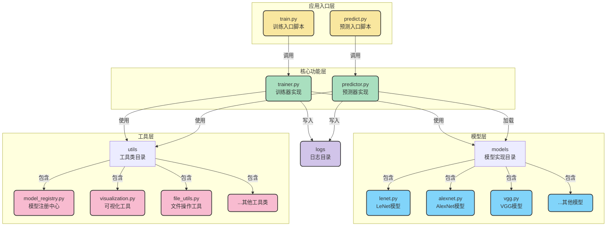

```mermaid
 graph TD
    %% 定义样式类
    classDef styleApp fill:#F9E79F,stroke:#333,stroke-width:2px,rx:8px,ry:8px;
    classDef styleCore fill:#A9DFBF,stroke:#333,stroke-width:2px,rx:8px,ry:8px;
    classDef styleModels fill:#81D4FA,stroke:#333,stroke-width:2px,rx:8px,ry:8px;
    classDef styleUtils fill:#F8BBD0,stroke:#333,stroke-width:2px,rx:8px,ry:8px;
    classDef styleLogs fill:#D1C4E9,stroke:#333,stroke-width:2px,rx:8px,ry:8px;
    
    %% 应用入口层
    subgraph 应用入口层
        TrainPy[train.py<br>训练入口脚本]:::styleApp
        PredictPy[predict.py<br>预测入口脚本]:::styleApp
    end

    %% 核心功能层
    subgraph 核心功能层
        Trainer[trainer.py<br>训练器实现]:::styleCore
        Predictor[predictor.py<br>预测器实现]:::styleCore
    end

    %% 模型层
    subgraph 模型层
        Models[models<br>模型实现目录]
        LeNet[lenet.py<br>LeNet模型]:::styleModels
        AlexNet[alexnet.py<br>AlexNet模型]:::styleModels
        VGG[vgg.py<br>VGG模型]:::styleModels
        OtherModels[...其他模型]:::styleModels
    end

    %% 工具层
    subgraph 工具层
        Utils[utils<br>工具类目录]
        ModelRegistry[model_registry.py<br>模型注册中心]:::styleUtils
        Visualization[visualization.py<br>可视化工具]:::styleUtils
        FileUtils[file_utils.py<br>文件操作工具]:::styleUtils
        OtherUtils[...其他工具类]:::styleUtils
    end

    %% 日志目录
    Logs[logs<br>日志目录]:::styleLogs

    %% 连接线
    TrainPy -->|调用| Trainer
    PredictPy -->|调用| Predictor
    
    Trainer -->|使用| Models
    Predictor -->|加载| Models
    
    Trainer -->|使用| Utils
    Predictor -->|使用| Utils
    
    Trainer -->|写入| Logs
    Predictor -->|写入| Logs
    
    Models -->|包含| LeNet
    Models -->|包含| AlexNet
    Models -->|包含| VGG
    Models -->|包含| OtherModels
    
    Utils -->|包含| ModelRegistry
    Utils -->|包含| Visualization
    Utils -->|包含| FileUtils
    Utils -->|包含| OtherUtils
```