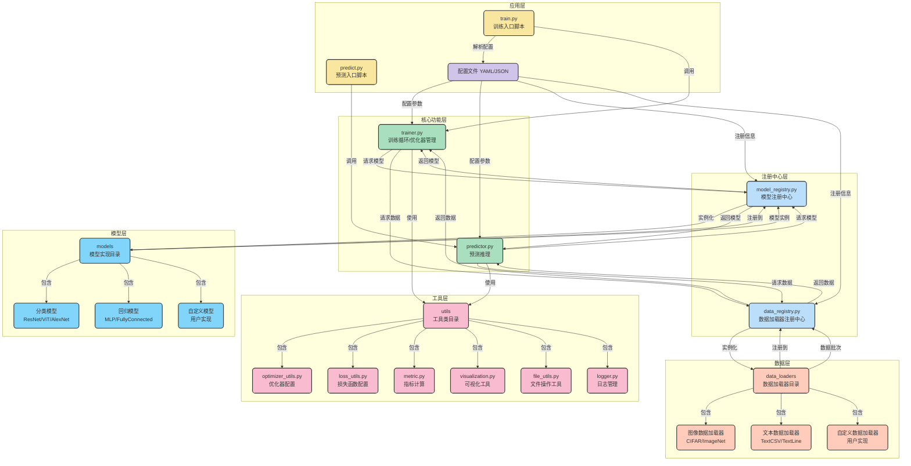

# 增强型深度学习框架架构设计

下面是经过优化的解耦架构设计，通过清晰的分层结构和明确的接口边界，使各层之间实现松耦合，便于维护和扩展。

## 架构说明

### 主要特点

1. **高度解耦的分层架构**
   - 每层具有明确的职责边界和标准接口
   - 通过注册中心层实现核心功能层与模型层、数据层的解耦
   - 清晰的数据流向设计，避免层间直接依赖和混乱的调用关系

2. **独立的注册中心层**
   - 将模型注册中心和数据加载器注册中心提升为独立层次
   - 作为核心功能层与模型层、数据层之间的桥梁
   - 统一管理组件的注册、发现和实例化过程

3. **多层次结构设计**
   - 应用层：用户交互入口，包含训练和预测脚本，负责启动流程和解析配置
   - 核心功能层：框架核心逻辑，专注于训练循环和预测推理，通过注册中心获取资源
   - 注册中心层：提供统一的组件管理机制，隔离核心逻辑与具体实现
   - 模型层：各类网络模型实现，支持分类、回归等不同类型
   - 数据层：数据加载和预处理功能
   - 工具层：提供独立的通用工具支持，包括优化器配置、损失函数、指标计算、可视化、文件操作和日志管理

4. **组件化与标准化设计**
   - 将模型、数据加载器、优化器、损失函数和指标计算抽象为独立组件
   - 各组件通过注册中心进行统一管理和实例化
   - 用户可通过简单配置实现组件间的灵活组合，无需修改核心代码

### 使用流程

1. **定义网络模型**
   - 继承基础模型类实现自定义网络逻辑
   - 通过装饰器或显式调用向模型注册中心注册模型类型
   - 模型实现完全独立于训练和预测逻辑

2. **添加自定义数据加载器**
   - 继承基础数据加载器类
   - 实现数据读取和预处理逻辑
   - 通过数据注册中心注册加载器类型
   - 数据加载器只关注数据处理，不与具体模型绑定

3. **配置训练参数**
   - 在配置文件中通过名称指定所需的模型、数据加载器、优化器等组件
   - 设置超参数、训练轮数、批量大小等配置项
   - 无需直接实例化或引用具体组件实现

4. **执行训练/预测**
   - 运行训练/预测脚本，应用层解析配置并调用核心功能层
   - 核心功能层通过注册中心动态获取并实例化所需组件
   - 各层组件通过标准化接口交互，保持松耦合状态

通过这种高度解耦的架构设计，实现了以下核心优势：
1. **关注点分离**：用户只需关注核心业务逻辑（模型定义、数据处理），无需关心框架内部实现细节
2. **提高可维护性**：清晰的层次边界和标准化接口使代码更易于理解和维护
3. **增强扩展性**：新增组件只需注册到相应的注册中心，无需修改现有代码
4. **提升灵活性**：通过配置文件即可灵活组合不同组件，实现不同的功能需求
5. **促进代码复用**：通用功能（训练循环、指标计算、日志记录、模型保存等）被抽象为独立工具，可在不同场景复用

这种设计极大地提高了开发效率和代码质量，同时降低了系统的复杂度和维护成本。