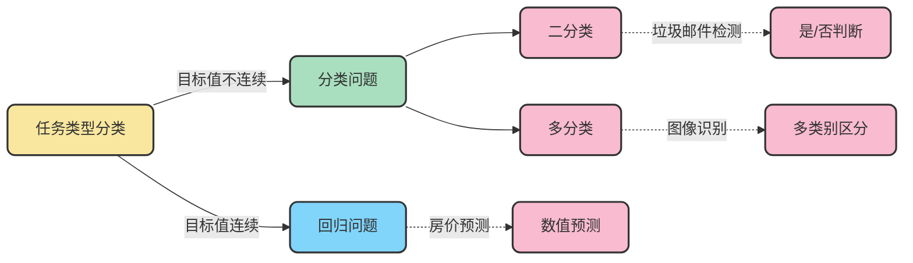
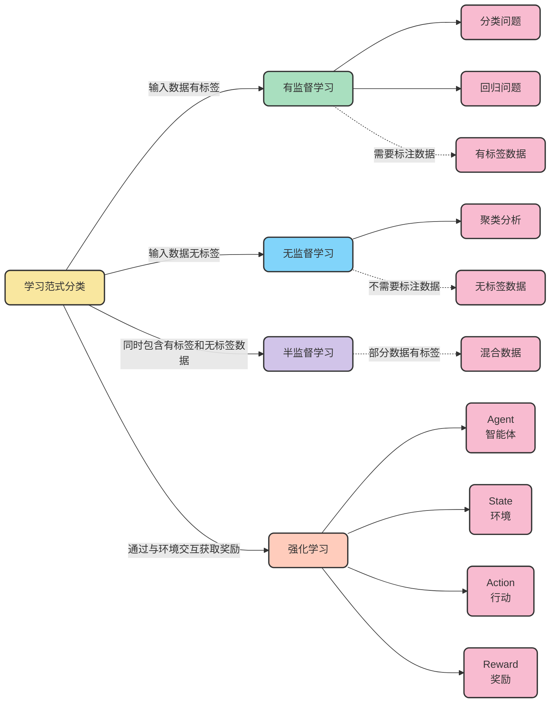

# 机器学习基础概念分类

## 任务类型分类

### 1. 分类问题
- **定义**：目标值（标签值）是不连续的
- **分类种类**：
  - 二分类：目标只有两种可能的结果（例如：垃圾邮件检测、疾病诊断）
  - 多分类：目标有三种或更多可能的结果（例如：图像识别、文本分类）

### 2. 回归问题
- **定义**：目标值（标签值）是连续的
- **应用场景**：预测数值型结果（例如：房价预测、股票价格预测、气温预测）
  
## 学习范式分类

  
### 1. 有监督学习(Supervised Learning)
- **定义**：输入训练集数据包含输入特征值和目标值
- **数据集特点**：需要标注数据的标签/目标值
- **典型任务**：
  - 回归：函数的输出是一个连续的值
  - 分类：函数的输出是有限个离散值

### 2. 无监督学习(Unsupervised Learning)
- **定义**：输入训练集数据是由输入特征值组成，没有目标值
- **核心思想**：根据样本间的相似性对样本集进行分类
- **数据集特点**：不需要标注数据
- **典型任务**：聚类分析、降维、关联规则挖掘

### 3. 半监督学习(Semi-Supervised Learning)
- **定义**：训练集同时包含有目标值的样本数据和不含有目标值的样本数据
- **数据集特点**：部分数据有标签，部分数据无标签
- **优势**：结合了有监督学习和无监督学习的优点，能够利用少量标注数据和大量未标注数据

### 4. 强化学习(Reinforcement Learning)
- **定义**：智能体不断与环境进行交互，通过获取最大奖励的方式（试错的方式）来获得最佳策略
- **核心元素**：
  - Agent(智能体)：执行动作的实体
  - 环境(State)：智能体所处的环境状态
  - 行动(Action)：智能体在环境中采取的行动
  - 奖励(reward)：智能体执行动作后获得的反馈信号
- **学习方式**：通过试错和反馈不断优化策略