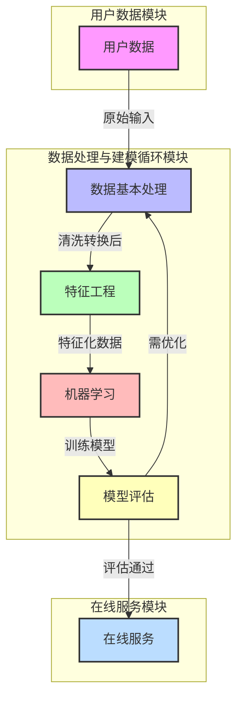

# 机器学习工作流程图

```mermaid
flowchart TD
    subgraph 用户数据模块
        A[用户数据]
    end
    
    subgraph 数据处理与建模循环模块
        B[数据基本处理] -->|清洗转换后| C[特征工程]
        C -->|特征化数据| D[机器学习]
        D -->|训练模型| E[模型评估]
        E -->|需优化| B
    end
    
    subgraph 在线服务模块
        F[在线服务]
    end
    
    A -->|原始输入| B
    E -->|评估通过| F
    
    style A fill:#f9f,stroke:#333,stroke-width:2px
    style B fill:#bbf,stroke:#333,stroke-width:2px
    style C fill:#bfb,stroke:#333,stroke-width:2px
    style D fill:#fbb,stroke:#333,stroke-width:2px
    style E fill:#ffb,stroke:#333,stroke-width:2px
    style F fill:#bdf,stroke:#333,stroke-width:2px
    
    classDef userDataModule fill:#ffebee,stroke:#c62828,stroke-width:2px
    classDef processModule fill:#e0f7fa,stroke:#006064,stroke-width:2px
    classDef serviceModule fill:#e8f5e9,stroke:#2e7d32,stroke-width:2px

    class A userDataModule
    class B,C,D,E processModule
    class F serviceModule
```