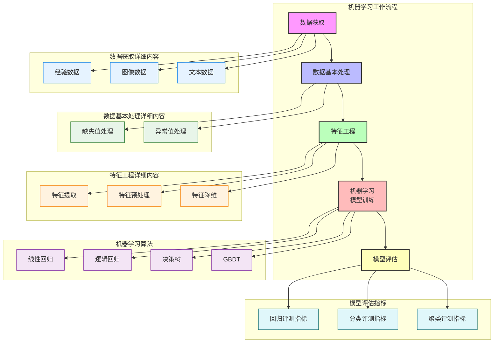

# 机器学习工作流程层次结构图

```mermaid
flowchart TD
    subgraph 机器学习工作流程
        A[数据获取] --> B[数据基本处理]
        B --> C[特征工程]
        C --> D[机器学习
模型训练]
        D --> E[模型评估]
    end
    
    subgraph 数据获取详细内容
        A --> A1[经验数据]
        A --> A2[图像数据]
        A --> A3[文本数据]
    end
    
    subgraph 数据基本处理详细内容
        B --> B1[缺失值处理]
        B --> B2[异常值处理]
    end
    
    subgraph 特征工程详细内容
        C --> C1[特征提取]
        C --> C2[特征预处理]
        C --> C3[特征降维]
    end
    
    subgraph 机器学习算法
        D --> D1[线性回归]
        D --> D2[逻辑回归]
        D --> D3[决策树]
        D --> D4[GBDT]
    end
    
    subgraph 模型评估指标
        E --> E1[回归评测指标]
        E --> E2[分类评测指标]
        E --> E3[聚类评测指标]
    end
    
    style A fill:#f9f,stroke:#333,stroke-width:2px
    style B fill:#bbf,stroke:#333,stroke-width:2px
    style C fill:#bfb,stroke:#333,stroke-width:2px
    style D fill:#fbb,stroke:#333,stroke-width:2px
    style E fill:#ffb,stroke:#333,stroke-width:2px
    
    classDef dataStage fill:#e6f3ff,stroke:#1e88e5,stroke-width:1px
    classDef processStage fill:#e8f5e9,stroke:#2e7d32,stroke-width:1px
    classDef featureStage fill:#fff3e0,stroke:#f57c00,stroke-width:1px
    classDef modelStage fill:#f3e5f5,stroke:#7b1fa2,stroke-width:1px
    classDef evalStage fill:#e0f7fa,stroke:#006064,stroke-width:1px
    
    class A,A1,A2,A3 dataStage
    class B,B1,B2 processStage
    class C,C1,C2,C3 featureStage
    class D,D1,D2,D3,D4 modelStage
    class E,E1,E2,E3 evalStage
```