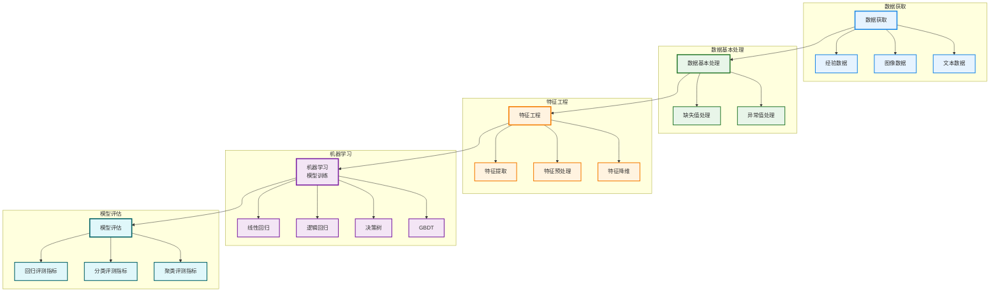

# 机器学习工作流程阶段详细图

这个图表清晰展示了机器学习工作流程的五个主要阶段及其具体内容：

1. **数据获取**：包括经验数据、图像数据和文本数据
2. **数据基本处理**：包括缺失值处理和异常值处理
3. **特征工程**：包括特征提取、特征预处理和特征降维
4. **机器学习(模型训练)**：包括线性回归、逻辑回归、决策树和GBDT等算法
5. **模型评估**：包括回归评测指标、分类评测指标和聚类评测指标

各阶段使用了不同的颜色区分，主要流程通过箭头清晰连接，使整个工作流程更加直观易懂。