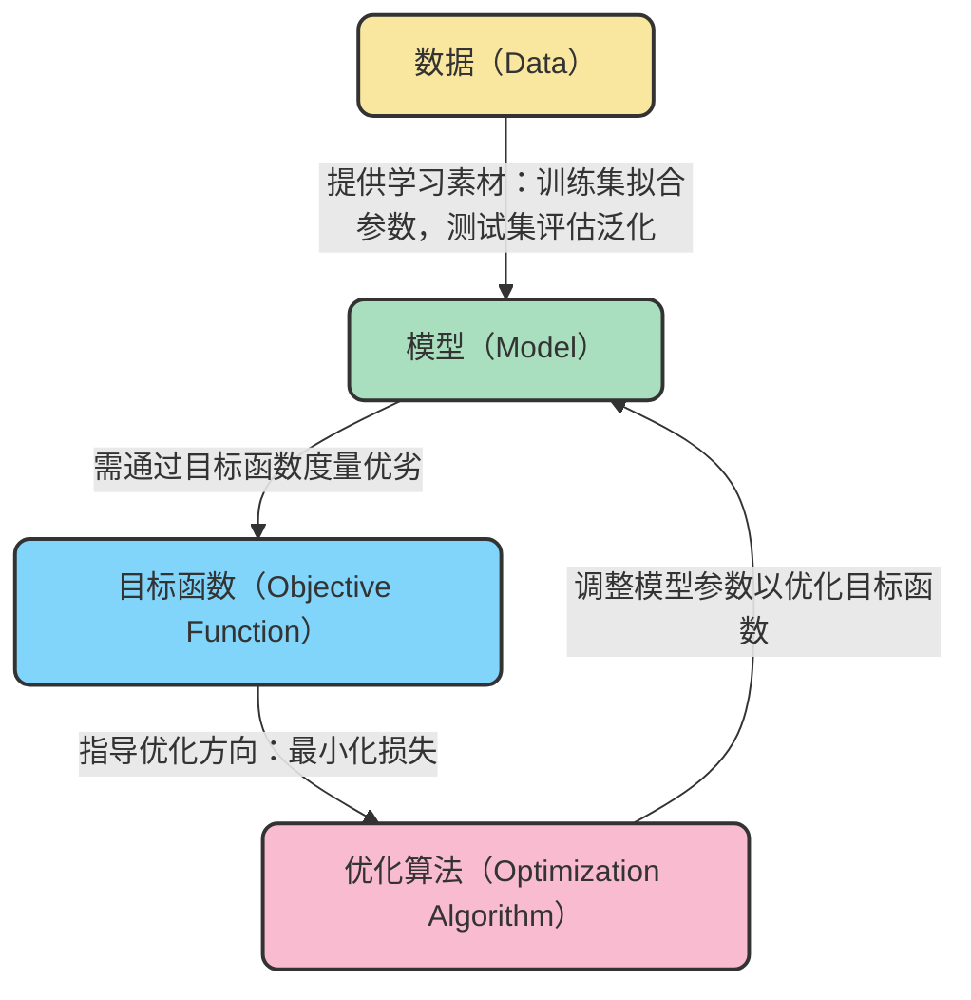

```mermaid
graph TD
    %% 定义样式类
    classDef styleA fill:#F9E79F,stroke:#333,stroke-width:2px,rx:8px,ry:8px;
    classDef styleB fill:#A9DFBF,stroke:#333,stroke-width:2px,rx:8px,ry:8px;
    classDef styleC fill:#81D4FA,stroke:#333,stroke-width:2px,rx:8px,ry:8px;
    classDef styleD fill:#F8BBD0,stroke:#333,stroke-width:2px,rx:8px,ry:8px;

    %% 流程图节点（使用类样式）
    A[数据（Data）]:::styleA -->|提供学习素材：训练集拟合参数，测试集评估泛化| B[模型（Model）]:::styleB
    B -->|需通过目标函数度量优劣| C[目标函数（Objective Function）]:::styleC
    C -->|指导优化方向：最小化损失| D[优化算法（Optimization Algorithm）]:::styleD
    D -->|调整模型参数以优化目标函数| B
```