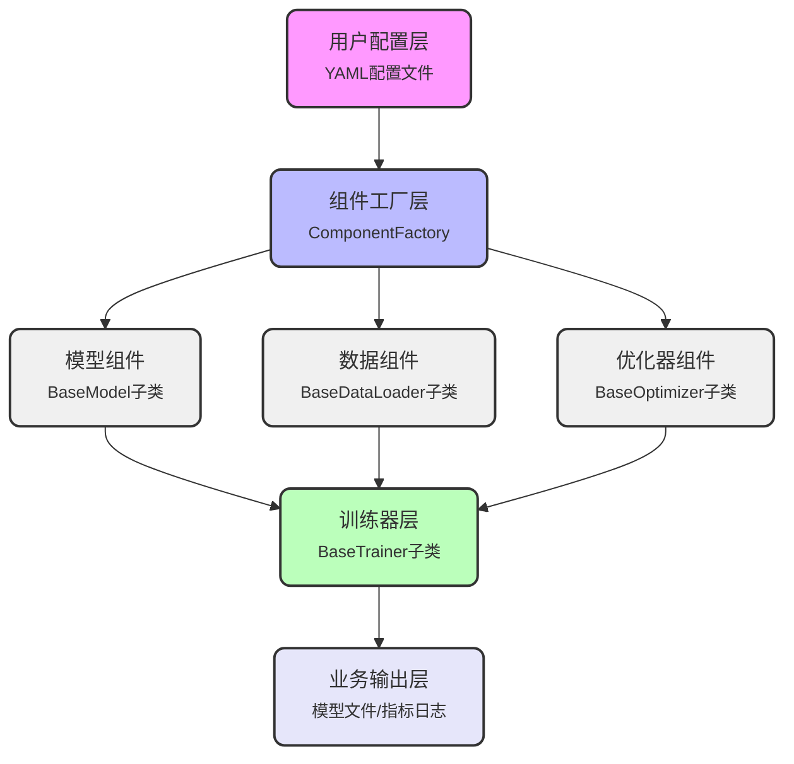

```mermaid
graph TD
    %% 定义样式类
    classDef styleConfig fill:#f9f,stroke:#333,stroke-width:2px,rx:8px,ry:8px;
    classDef styleFactory fill:#bbf,stroke:#333,stroke-width:2px,rx:8px,ry:8px;
    classDef styleComponent fill:#f0f0f0,stroke:#333,stroke-width:2px,rx:8px,ry:8px;
    classDef styleTrainer fill:#bfb,stroke:#333,stroke-width:2px,rx:8px,ry:8px;
    classDef styleOutput fill:#e6e6fa,stroke:#333,stroke-width:2px,rx:8px,ry:8px;
    
    %% 流程节点（绑定样式类）
    A[用户配置层<br/><small>YAML配置文件</small>]:::styleConfig --> B[组件工厂层<br/><small>ComponentFactory</small>]:::styleFactory
    B --> C1[模型组件<br/><small>BaseModel子类</small>]:::styleComponent
    B --> C2[数据组件<br/><small>BaseDataLoader子类</small>]:::styleComponent
    B --> C3[优化器组件<br/><small>BaseOptimizer子类</small>]:::styleComponent
    C1 & C2 & C3 --> D[训练器层<br/><small>BaseTrainer子类</small>]:::styleTrainer
    D --> E[业务输出层<br/><small>模型文件/指标日志</small>]:::styleOutput
```