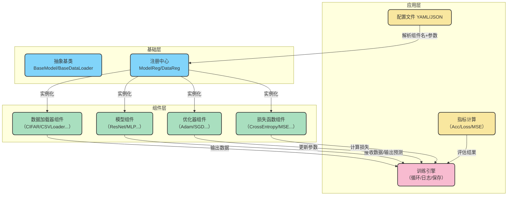

```mermaid
graph TD
    %% 定义样式类
    classDef styleApp fill:#F9E79F,stroke:#333,stroke-width:2px,rx:8px,ry:8px;
    classDef styleComp fill:#A9DFBF,stroke:#333,stroke-width:2px,rx:8px,ry:8px;
    classDef styleBase fill:#81D4FA,stroke:#333,stroke-width:2px,rx:8px,ry:8px;
    classDef styleEngine fill:#F8BBD0,stroke:#333,stroke-width:2px,rx:8px,ry:8px;
    
    %% 应用层节点
    subgraph 应用层
        Config[配置文件 YAML/JSON]:::styleApp
        TrainEngine[训练引擎<br>（循环/日志/保存）]:::styleEngine
        Metric[指标计算<br>（Acc/Loss/MSE）]:::styleApp
    end

    %% 组件层节点
    subgraph 组件层
        ModelComp[模型组件<br>（ResNet/MLP...）]:::styleComp
        DataComp[数据加载器组件<br>（CIFAR/CSVLoader...）]:::styleComp
        OptComp[优化器组件<br>（Adam/SGD...）]:::styleComp
        LossComp[损失函数组件<br>（CrossEntropy/MSE...）]:::styleComp
    end

    %% 基础层节点
    subgraph 基础层
        BaseClass[抽象基类<br>BaseModel/BaseDataLoader]:::styleBase
        RegCenter[注册中心<br>ModelReg/DataReg]:::styleBase
    end

    %% 连接线
    Config -->|解析组件名+参数| RegCenter
    RegCenter -->|实例化| ModelComp
    RegCenter -->|实例化| DataComp
    RegCenter -->|实例化| OptComp
    RegCenter -->|实例化| LossComp

    DataComp -->|输出数据| TrainEngine
    ModelComp -->|接收数据/输出预测| TrainEngine
    OptComp -->|更新参数| TrainEngine
    LossComp -->|计算损失| TrainEngine
    Metric -->|评估结果| TrainEngine
```