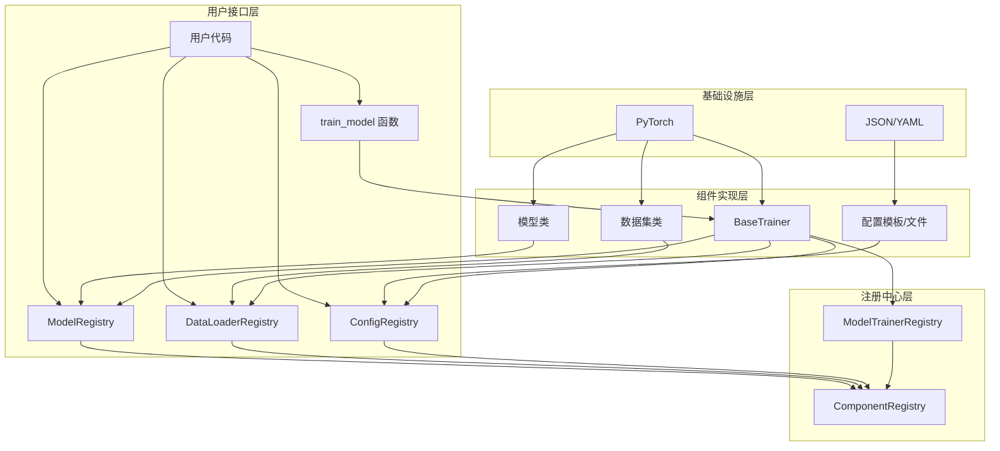
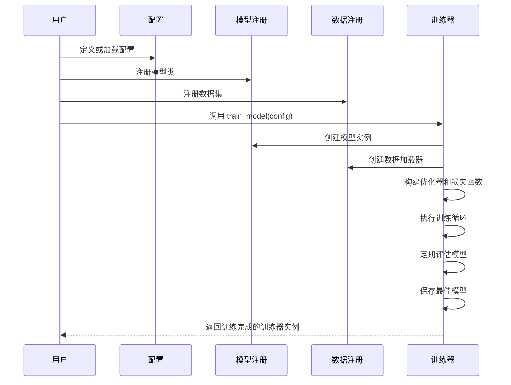

# model_center 模块文档

## 1. 模块概述

**model_center** 是一个通用的模型注册和训练框架，提供完整的深度学习模型管理、配置、训练和评估功能。该模块采用注册中心模式设计，支持命名空间隔离，可灵活注册和管理不同类型的模型、数据加载器和配置，实现训练流程的标准化和模块化。

### 主要功能特点
- **统一的模型注册机制**：支持跨命名空间的模型注册和管理
- **灵活的配置系统**：支持从文件、模板或代码注册和加载配置
- **标准化的训练流程**：提供完整的训练、评估、早停和模型保存功能
- **模块化设计**：各组件松耦合，易于扩展和定制
- **丰富的示例代码**：包含多种使用场景的示例实现

## 2. 架构设计

model_center 模块采用层次化架构设计，基于注册中心模式实现组件的统一管理和灵活使用。以下是模块的核心架构图：



### 架构说明
- **用户接口层**：提供给用户直接调用的API，包括各个注册中心类和便捷函数
- **注册中心层**：实现组件的注册、查找和管理，所有注册中心继承自基础的 ComponentRegistry
- **组件实现层**：包含具体的模型、数据集、训练器和配置实现
- **基础设施层**：依赖的外部库和技术栈

## 3. 核心组件

### 3.1 注册中心组件

#### ComponentRegistry
基础注册中心类，实现了通用的组件注册和管理机制。采用三级字典结构 `{namespace: {type: {component_name: component}}}` 存储组件，支持命名空间隔离和跨命名空间查找。

```python
# 基础注册中心的核心实现
_components: Dict[str, Dict[str, Dict[str, Any]]] = {"default": {"default": {}}}
```
<mcfile name="base_registry.py" path="e:/github_project/d2l_note/src/model_center/base_registry.py"></mcfile>

#### ModelRegistry
模型注册中心，用于管理深度学习模型类、配置和测试函数。支持通过装饰器方式注册模型，并提供模型实例创建功能。

```python
# 模型注册示例
@ModelRegistry.register_model(
    model_name="lenet",
    config={"in_channels": 1, "num_classes": 10},
    namespace="mnist"
)class LeNet(nn.Module):
    # 模型实现...
```
<mcfile name="model_registry.py" path="e:/github_project/d2l_note/src/model_center/model_registry.py"></mcfile>

#### DataLoaderRegistry
数据加载器注册中心，用于管理数据集和创建数据加载器。支持注册数据集类、配置和预处理函数。

```python
# 数据集注册示例
@DataLoaderRegistry.register_dataset(
    name="mnist",
    namespace="datasets"
)class MNISTDataset(Dataset):
    # 数据集实现...
```
<mcfile name="data_loader_registry.py" path="e:/github_project/d2l_note/src/model_center/data_loader_registry.py"></mcfile>

#### ConfigRegistry
配置注册中心，用于管理和加载训练配置。支持从模板、文件或代码注册和加载配置，并提供配置验证功能。

```python
# 注册配置模板
ConfigRegistry.register_template(
    name="mnist_config",
    config={
        "model": {"name": "lenet", "namespace": "mnist"},
        "data": {"train_dataset": {"name": "mnist", "namespace": "datasets"}},
        "training": {"epochs": 10, "batch_size": 32}
    }
)
```
<mcfile name="config_registry.py" path="e:/github_project/d2l_note/src/model_center/config_registry.py"></mcfile>

### 3.2 训练器组件

#### BaseTrainer
训练器基类，提供完整的模型训练和评估功能，包括：
- 自动构建模型、优化器、损失函数和数据加载器
- 支持多轮训练和每轮评估
- 实现学习率调度和早停机制
- 自动保存和加载模型检查点

```python
# 训练器核心方法
class BaseTrainer:
    def build_components(self):  # 构建训练组件
    def train_one_epoch(self):   # 训练一个epoch
    def evaluate(self):          # 评估模型
    def train(self):             # 完整训练流程
    def save_checkpoint(self):   # 保存模型检查点
    def load_checkpoint(self):   # 加载模型检查点
```
<mcfile name="trainer.py" path="e:/github_project/d2l_note/src/model_center/trainer.py"></mcfile>

#### ModelTrainerRegistry
训练器注册中心，用于管理和创建不同类型的训练器。支持自定义训练器的注册和实例化。

```python
# 训练器注册示例
@ModelTrainerRegistry.register(
    name="custom_trainer",
    namespace="my_project"
)class CustomTrainer(BaseTrainer):
    # 自定义训练器实现...
```
<mcfile name="trainer.py" path="e:/github_project/d2l_note/src/model_center/trainer.py"></mcfile>

## 4. 工作流程

model_center 模块的典型工作流程如下：



### 详细流程说明
1. **配置准备**：用户定义或从文件加载训练配置，包括模型、数据和训练参数
2. **组件注册**：用户注册自定义模型、数据集和训练器（如果需要）
3. **训练初始化**：调用 `train_model` 函数，创建训练器实例并构建所有组件
4. **训练执行**：训练器执行完整的训练流程，包括多轮训练和评估
5. **模型保存**：训练过程中自动保存最佳模型和检查点
6. **结果返回**：训练完成后返回训练器实例，用户可获取训练历史和模型

## 5. 使用方法

### 5.1 基本用法

以下是使用 model_center 模块的基本步骤：

#### 1. 导入必要的模块
```python
from src.model_center import ModelRegistry, DataLoaderRegistry, ConfigRegistry, train_model
import torch
from torch import nn
from torch.utils.data import Dataset
```

#### 2. 注册模型
```python
@ModelRegistry.register_model(
    model_name="my_model",
    config={"in_channels": 3, "num_classes": 10},
    namespace="custom_models"
)class MyModel(nn.Module):
    def __init__(self, in_channels=3, num_classes=10):
        super().__init__()
        # 模型定义...
        
    def forward(self, x):
        # 前向传播实现...
        return x
```

#### 3. 注册数据集
```python
@DataLoaderRegistry.register_dataset(
    name="my_dataset",
    namespace="custom_datasets"
)class MyDataset(Dataset):
    def __init__(self, data_path, train=True):
        # 数据集初始化...
        
    def __getitem__(self, index):
        # 获取数据项...
        return data, label
        
    def __len__(self):
        # 返回数据集大小...
        return len(self.data)
```

#### 4. 定义训练配置
```python
config = {
    "model": {
        "name": "my_model",
        "namespace": "custom_models",
        "args": {"in_channels": 3, "num_classes": 10}
    },
    "data": {
        "train_dataset": {
            "name": "my_dataset",
            "namespace": "custom_datasets",
            "args": {"data_path": "./data", "train": True}
        },
        "test_dataset": {
            "name": "my_dataset",
            "namespace": "custom_datasets",
            "args": {"data_path": "./data", "train": False}
        },
        "batch_size": 32,
        "shuffle": True,
        "num_workers": 4
    },
    "training": {
        "epochs": 20,
        "device": "cuda" if torch.cuda.is_available() else "cpu",
        "optimizer": {"name": "adam", "args": {"lr": 0.001}},
        "loss_function": {"name": "cross_entropy"},
        "checkpoint_dir": "./checkpoints",
        "early_stopping": {"enabled": True, "patience": 5}
    }
}
```

#### 5. 训练模型
```python
# 方式1：使用便捷函数
 trainer = train_model(config)
 
# 方式2：手动创建和使用训练器
# trainer = create_default_trainer(config)
# trainer.train()

# 获取训练历史
history = trainer.history
print(f"最佳准确率: {max(history['test_acc']):.2f}%")
```

### 5.2 从配置文件加载配置

```python
# 注册配置文件
ConfigRegistry.register_file("my_config", "./configs/my_config.json")

# 加载配置
config = ConfigRegistry.load_config_from_file("my_config")

# 修改配置
config['training']['epochs'] = 30

# 训练模型
trainer = train_model(config)
```

### 5.3 使用自定义训练器

```python
# 定义自定义训练器
@ModelTrainerRegistry.register(name="custom_trainer")
class CustomTrainer(BaseTrainer):
    def __init__(self, config, custom_param=None):
        super().__init__(config)
        self.custom_param = custom_param
        
    # 重写方法以自定义训练行为
    def train_one_epoch(self, epoch):
        # 自定义训练逻辑...
        return avg_loss, accuracy

# 使用自定义训练器
config['training']['trainer'] = {'name': 'custom_trainer'}
trainer = ModelTrainerRegistry.create_trainer(
    "custom_trainer", 
    config,
    custom_param="my_param"
)
trainer.train()
```

## 6. 示例代码

model_center 模块提供了多个示例代码，展示不同场景下的使用方法：

| 示例文件 | 功能描述 | 位置 |
|---------|---------|------|
| mnist_example.py | 使用预定义组件训练 MNIST 数据集 | <mcfile name="mnist_example.py" path="e:/github_project/d2l_note/src/model_center/examples/mnist_example.py"></mcfile> |
| lenet_example.py | 自定义 LeNet 模型并训练 | <mcfile name="lenet_example.py" path="e:/github_project/d2l_note/src/model_center/examples/lenet_example.py"></mcfile> |
| custom_trainer_example.py | 自定义训练器实现 | <mcfile name="custom_trainer_example.py" path="e:/github_project/d2l_note/src/model_center/examples/custom_trainer_example.py"></mcfile> |

## 7. 最佳实践

### 7.1 命名空间管理
- 为不同项目或模块使用不同的命名空间，避免组件名称冲突
- 推荐使用项目名称或模块名称作为命名空间
- 通用组件可放在默认命名空间中

### 7.2 配置管理
- 对于复杂项目，建议使用 JSON 或 YAML 文件存储配置
- 利用配置模板功能，创建常用配置的模板并在不同项目中复用
- 使用配置验证功能确保配置的完整性和正确性

### 7.3 模型设计
- 遵循 PyTorch 模型设计最佳实践，确保模型可序列化和加载
- 为模型提供合理的默认配置，简化使用过程
- 为复杂模型提供测试函数，验证模型的正确性

### 7.4 训练调优
- 合理设置早停参数，避免过拟合
- 使用学习率调度器，优化训练过程
- 定期保存检查点，以便恢复训练或进行推理

## 8. 目录结构

model_center 模块的目录结构如下：

```
src/model_center/
├── __init__.py        # 模块初始化和公共API导出
├── base_registry.py   # 基础注册中心类实现
├── model_registry.py  # 模型注册中心实现
├── data_loader_registry.py  # 数据加载器注册中心实现
├── config_registry.py # 配置注册中心实现
├── trainer.py         # 训练器实现
├── examples/          # 示例代码目录
│   ├── mnist_example.py
│   ├── lenet_example.py
│   └── custom_trainer_example.py
└── docs/              # 文档目录
    └── README_custom_trainer.md
```

## 9. 版本信息

当前版本：1.0.0

## 10. 许可证

[MIT License](https://opensource.org/licenses/MIT)

## 11. 联系与支持

如有问题或建议，请提交 Issue 或联系开发团队。