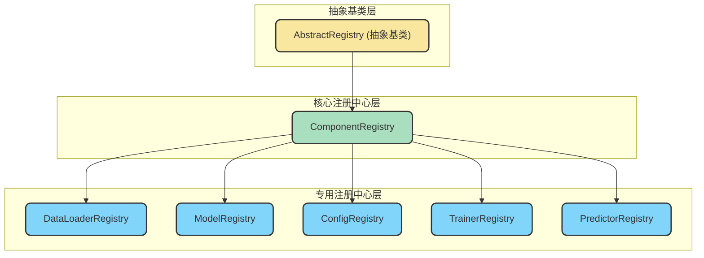
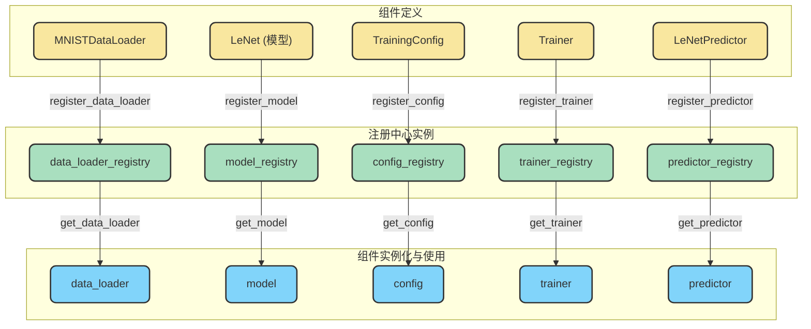
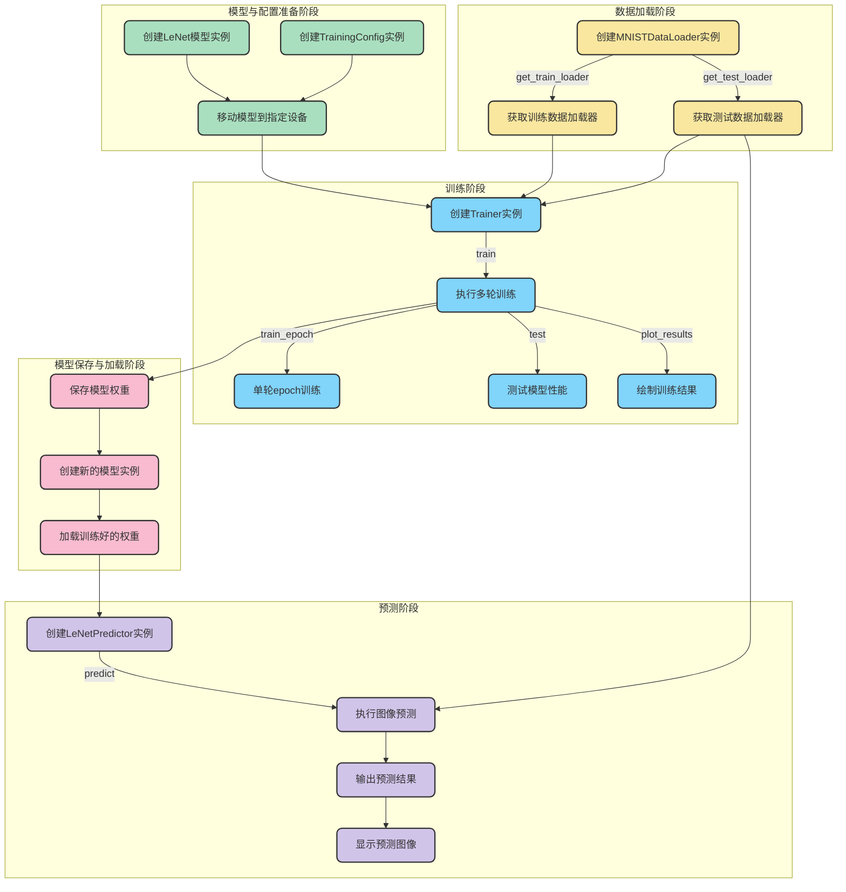
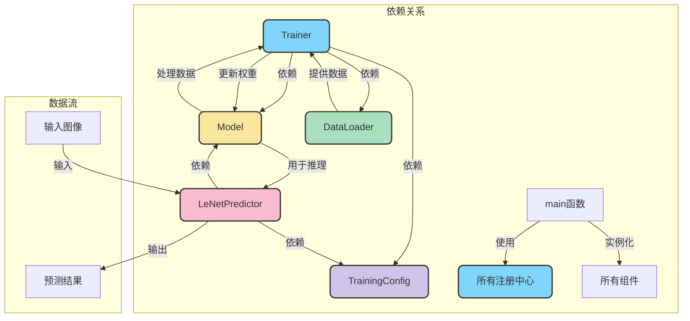

# UniML Model Center 核心组件流程图

## 1. 注册中心架构

```mermaid
graph TD
    classDef styleA fill:#F9E79F,stroke:#333,stroke-width:2px,rx:8px,ry:8px;
    classDef styleB fill:#A9DFBF,stroke:#333,stroke-width:2px,rx:8px,ry:8px;
    classDef styleC fill:#81D4FA,stroke:#333,stroke-width:2px,rx:8px,ry:8px;
    
    subgraph "抽象基类层"
        AbstractRegistry["AbstractRegistry (抽象基类)"]:::styleA
    end

    subgraph "核心注册中心层"
        ComponentRegistry["ComponentRegistry"]:::styleB
    end

    subgraph "专用注册中心层"
        DataLoaderRegistry["DataLoaderRegistry"]:::styleC
        ModelRegistry["ModelRegistry"]:::styleC
        ConfigRegistry["ConfigRegistry"]:::styleC
        TrainerRegistry["TrainerRegistry"]:::styleC
        PredictorRegistry["PredictorRegistry"]:::styleC
    end

    AbstractRegistry --> ComponentRegistry
    ComponentRegistry --> DataLoaderRegistry
    ComponentRegistry --> ModelRegistry
    ComponentRegistry --> ConfigRegistry
    ComponentRegistry --> TrainerRegistry
    ComponentRegistry --> PredictorRegistry
```

## 2. 组件注册与获取流程

```mermaid
graph TD
    classDef styleA fill:#F9E79F,stroke:#333,stroke-width:2px,rx:8px,ry:8px;
    classDef styleB fill:#A9DFBF,stroke:#333,stroke-width:2px,rx:8px,ry:8px;
    classDef styleC fill:#81D4FA,stroke:#333,stroke-width:2px,rx:8px,ry:8px;
    classDef styleD fill:#F8BBD0,stroke:#333,stroke-width:2px,rx:8px,ry:8px;
    
    subgraph "组件定义"
        MNISTDataLoader["MNISTDataLoader"]:::styleA
        LeNet["LeNet (模型)"]:::styleA
        TrainingConfig["TrainingConfig"]:::styleA
        Trainer["Trainer"]:::styleA
        LeNetPredictor["LeNetPredictor"]:::styleA
    end

    subgraph "注册中心实例"
        data_loader_registry["data_loader_registry"]:::styleB
        model_registry["model_registry"]:::styleB
        config_registry["config_registry"]:::styleB
        trainer_registry["trainer_registry"]:::styleB
        predictor_registry["predictor_registry"]:::styleB
    end

    subgraph "组件实例化与使用"
        data_loader["data_loader"]:::styleC
        model["model"]:::styleC
        config["config"]:::styleC
        trainer["trainer"]:::styleC
        predictor["predictor"]:::styleC
    end

    MNISTDataLoader --> |register_data_loader| data_loader_registry
    LeNet --> |register_model| model_registry
    TrainingConfig --> |register_config| config_registry
    Trainer --> |register_trainer| trainer_registry
    LeNetPredictor --> |register_predictor| predictor_registry

    data_loader_registry --> |get_data_loader| data_loader
    model_registry --> |get_model| model
    config_registry --> |get_config| config
    trainer_registry --> |get_trainer| trainer
    predictor_registry --> |get_predictor| predictor
```

## 3. 完整训练与预测流程

```mermaid
graph TD
    classDef styleA fill:#F9E79F,stroke:#333,stroke-width:2px,rx:8px,ry:8px;
    classDef styleB fill:#A9DFBF,stroke:#333,stroke-width:2px,rx:8px,ry:8px;
    classDef styleC fill:#81D4FA,stroke:#333,stroke-width:2px,rx:8px,ry:8px;
    classDef styleD fill:#F8BBD0,stroke:#333,stroke-width:2px,rx:8px,ry:8px;
    classDef styleE fill:#D1C4E9,stroke:#333,stroke-width:2px,rx:8px,ry:8px;
    
    subgraph "数据加载阶段"
        A[创建MNISTDataLoader实例]:::styleA --> |get_train_loader| B[获取训练数据加载器]:::styleA
        A --> |get_test_loader| C[获取测试数据加载器]:::styleA
    end

    subgraph "模型与配置准备阶段"
        D[创建LeNet模型实例]:::styleB --> F[移动模型到指定设备]:::styleB
        E[创建TrainingConfig实例]:::styleB --> F
    end

    subgraph "训练阶段"
        F --> G[创建Trainer实例]:::styleC 
        G --> |train| H[执行多轮训练]:::styleC
        H --> |train_epoch| I[单轮epoch训练]:::styleC
        H --> |test| J[测试模型性能]:::styleC
        H --> |plot_results| K[绘制训练结果]:::styleC
    end

    subgraph "模型保存与加载阶段"
        H --> L[保存模型权重]:::styleD
        L --> M[创建新的模型实例]:::styleD
        M --> N[加载训练好的权重]:::styleD
    end

    subgraph "预测阶段"
        N --> O[创建LeNetPredictor实例]:::styleE
        O --> |predict| P[执行图像预测]:::styleE
        P --> Q[输出预测结果]:::styleE
        Q --> R[显示预测图像]:::styleE
    end

    B --> G
    C --> G
    C --> P
```

## 4. 核心组件依赖关系

```mermaid
graph TD
    classDef styleA fill:#F9E79F,stroke:#333,stroke-width:2px,rx:8px,ry:8px;
    classDef styleB fill:#A9DFBF,stroke:#333,stroke-width:2px,rx:8px,ry:8px;
    classDef styleC fill:#81D4FA,stroke:#333,stroke-width:2px,rx:8px,ry:8px;
    classDef styleD fill:#F8BBD0,stroke:#333,stroke-width:2px,rx:8px,ry:8px;
    classDef styleE fill:#D1C4E9,stroke:#333,stroke-width:2px,rx:8px,ry:8px;
    
    subgraph "依赖关系"
        Trainer:::styleC -- 依赖 --> Model:::styleA
        Trainer -- 依赖 --> DataLoader:::styleB
        Trainer -- 依赖 --> TrainingConfig:::styleE
        LeNetPredictor:::styleD -- 依赖 --> Model
        LeNetPredictor -- 依赖 --> TrainingConfig
        main["main函数"] -- 使用 --> 所有注册中心:::styleC
        main -- 实例化 --> 所有组件
    end

    subgraph "数据流"
        DataLoader -- 提供数据 --> Trainer
        Model -- 处理数据 --> Trainer
        Trainer -- 更新权重 --> Model
        Model -- 用于推理 --> LeNetPredictor
        Image["输入图像"] -- 输入 --> LeNetPredictor
        LeNetPredictor -- 输出 --> PredictionResult["预测结果"]
    end
```